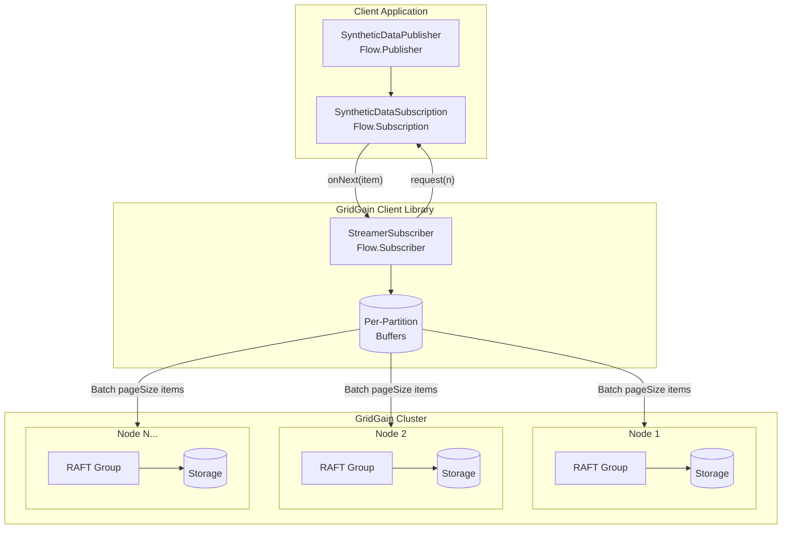
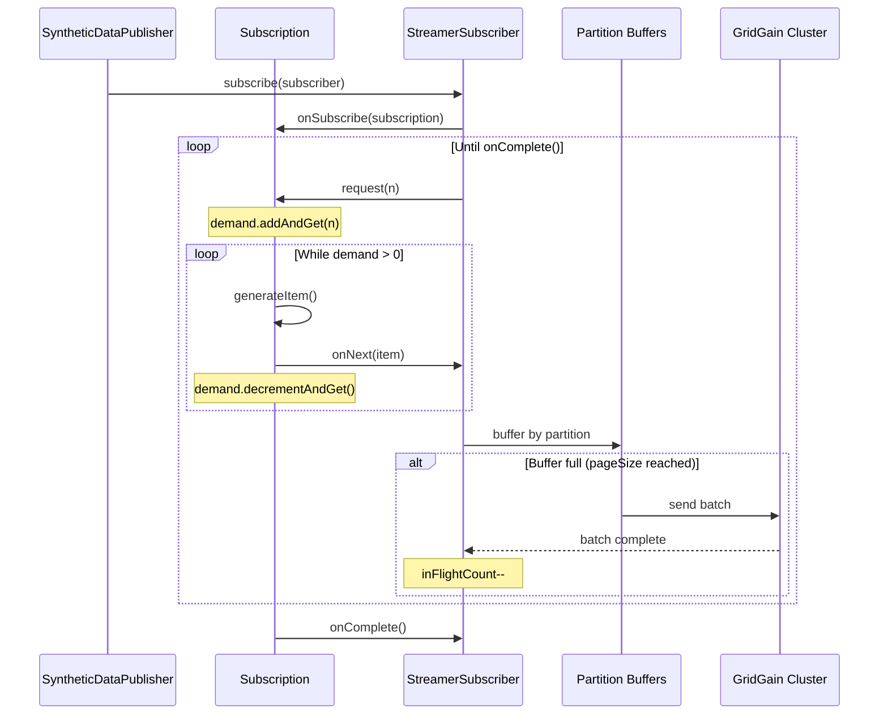

# DataStreamer Backpressure: SubmissionPublisher vs Custom Flow.Publisher

This document explains why a custom `Flow.Publisher` implementation handles high-volume streaming better than `SubmissionPublisher`.

## Native Backpressure in GridGain 9

The DataStreamer implements request-based backpressure through the Java Flow API. The internal `StreamerSubscriber` calculates how many items to request:

```java
var desiredInFlight = buffers.size() * options.pageSize() * options.perPartitionParallelOperations();
var toRequest = desiredInFlight - inFlight - pending;

if (toRequest <= 0) {
    return; // Backpressure: don't request more items
}

subscription.request(toRequest);
```

This mechanism works with any `Flow.Publisher` implementation. The difference is where record generation happens relative to these requests.

## The Problem

When streaming 20 million records with 1KB payloads, the producer generates data faster than the cluster can persist it. Without proper backpressure, this mismatch causes buffer overflow, memory exhaustion, and cluster instability.

## Two Approaches

### Original: SubmissionPublisher with Blocking Submit

```java
try (var publisher = new SubmissionPublisher<DataStreamerItem<ggTestTableA>>()) {
    streamerFut = view.streamData(publisher, options);

    for (int i = startKeyId; i <= endKeyId; i++) {
        ggTestTableA entry = new ggTestTableA(id, column1, column2, ldt);
        publisher.submit(DataStreamerItem.of(entry));  // Blocks when buffer full
    }
}
```

`SubmissionPublisher.submit()` blocks when its internal buffer fills up. This creates backpressure, but the blocking happens at the JVM level with no awareness of downstream capacity. The producer keeps generating records and pushing them into the buffer until it blocks.

### Custom: Demand-Driven Flow.Publisher

```java
public void request(long n) {
    demand.addAndGet(n);
    deliverItems();
}

private void deliverItemsSynchronously() {
    while (demand.get() > 0 && !cancelled.get()) {
        DataStreamerItem<Tuple> item = generateItem(currentGenerated);
        subscriber.onNext(item);
        demand.decrementAndGet();
    }
}
```

The custom publisher generates records only when the DataStreamer requests them. No record is created until there is confirmed capacity to process it.

## Why This Matters

Both approaches work with the DataStreamer's native backpressure. The difference is where records wait:

| Aspect | SubmissionPublisher | Custom Flow.Publisher |
|--------|---------------------|----------------------|
| Record generation | Ahead of demand, into buffer | On-demand, when requested |
| Memory location | Publisher's internal buffer | Not allocated until needed |
| Backpressure layer | Publisher buffer + native | Native only |
| Producer thread | Blocks when buffer full | Pauses between requests |

### Buffer Behavior

**SubmissionPublisher**: Generates 1M records per batch into a fixed buffer. When the buffer fills (default 256 items), `submit()` blocks. The producer has already allocated memory for records that cannot be processed yet.

**Custom Publisher**: The DataStreamer requests items (e.g., 500 at a time based on pageSize). The publisher generates exactly 500 records, sends them, then waits. No excess records exist in memory.

### Under Heavy Load

When the cluster slows due to checkpoint pressure or RAFT consensus delays:

**SubmissionPublisher**: Continues generating records until buffer blocks. Creates memory pressure on the client. When unblocked, dumps buffered records causing I/O spikes on the cluster.

**Custom Publisher**: Receives fewer `request()` calls from the DataStreamer. Generates fewer records. Client and cluster stay synchronized without intervention.

## Implementation Differences

### Original Application Structure

1. Create `SubmissionPublisher`
2. Start `streamData()`
3. Loop through all records, calling `submit()` for each
4. Close publisher, wait for completion
5. Repeat for next batch

The tight loop pushes records as fast as the CPU can generate them. The only throttle is buffer exhaustion.

### Custom Publisher Structure

1. Create custom `Flow.Publisher` with target record count
2. Start `streamData()` which triggers `subscribe()`
3. DataStreamer calls `request(n)` when ready for more records
4. Publisher generates exactly `n` records and delivers them
5. Repeat until target count reached, then call `onComplete()`

The DataStreamer controls the pace. The publisher responds to demand rather than creating it.

### Data Pipeline Architecture



## How Demand Flows Between GridGain and Your Application

The custom publisher approach relies on the Java Flow API (`java.util.concurrent.Flow`, JDK 9+):

| Interface | Implemented By | Role |
|-----------|----------------|------|
| `Flow.Publisher<T>` | Your application | Produces items |
| `Flow.Subscriber<T>` | GridGain (`StreamerSubscriber`) | Consumes items |
| `Flow.Subscription` | Your application | Controls flow |

### GridGain APIs

**Entry point:**

```java
RecordView<Tuple> view = client.tables().table(TABLE_NAME).recordView();
CompletableFuture<Void> streamFuture = view.streamData(publisher, options);
```

**Configuration:**

```java
DataStreamerOptions options = DataStreamerOptions.builder()
    .pageSize(500)
    .perPartitionParallelOperations(8)
    .autoFlushInterval(1000)
    .build();
```

**Data wrapper:**

```java
DataStreamerItem.of(tuple)  // Wraps your Tuple for streaming
```

### The Handshake Sequence

```text
1. view.streamData(publisher, options)
       │
       │  // Application initiates streaming, GridGain becomes the subscriber
       │
2. GridGain calls: publisher.subscribe(gridgainSubscriber)
       │
       │  // Publisher receives GridGain's subscriber, creates a Subscription
       │
3. Your code calls: gridgainSubscriber.onSubscribe(yourSubscription)
       │
       │  // GridGain now holds your Subscription, calculates initial demand
       │
4. GridGain stores yourSubscription, calls: yourSubscription.request(n)
       │
       │  // Publisher receives demand signal, generates exactly n items
       │
5. Your code generates n items, calls: gridgainSubscriber.onNext(item) for each
       │
       │  // GridGain buffers items, sends batches to cluster, tracks in-flight count
       │
6. GridGain processes items, when ready calls: yourSubscription.request(n) again
       │
       │  // Cycle continues: GridGain requests, publisher generates, until done
       │
       └── Repeat 5-6 until onComplete()
```

### Demand Tracking

The custom publisher uses `java.util.concurrent.atomic.AtomicLong` to track demand:

```java
private final AtomicLong demand = new AtomicLong(0);

public void request(long n) {           // GridGain calls this
    demand.addAndGet(n);                // Track requested items
    deliverItems();
}

private void deliverItemsSynchronously() {
    while (demand.get() > 0 && ...) {   // Generate while demand exists
        subscriber.onNext(item);        // Send to GridGain
        demand.decrementAndGet();       // One less demanded
    }
}
```

GridGain decides when to call `request(n)` based on its internal capacity formula. Your publisher never sees this calculation. It responds to `request(n)` calls.

### Temporal Flow of Demand and Data



## Configuration Impact

The DataStreamer's native backpressure is controlled by two options:

- **pageSize**: Items per network call (default: 1000)
- **perPartitionParallelOperations**: Concurrent batches per partition (default: 1)

The formula `buffers.size() × pageSize × perPartitionParallelOperations` determines maximum in-flight items per partition.

Total client memory pressure across all partitions: `pageSize × parallelOps × partitions × recordSize`

With 25 partitions and ~1KB records:

| Configuration | Page Size | Parallel Ops | In-Flight Data |
|---------------|-----------|--------------|----------------|
| Original team | 1,000 | 1 | 27.5 MB |
| Custom publisher | 500 | 8 | 110 MB |

The original team used `pageSize=1000, parallelOps=1` with `SubmissionPublisher`. Result: 394 lease failures, 986 replication lag warnings, ~18 minutes.

The custom publisher with `pageSize=500, parallelOps=8` completed in ~7 minutes with zero lease failures. Smaller batches with higher parallelism create steady demand signals, resulting in smooth I/O patterns that the cluster checkpoint system can handle.

## Summary

The DataStreamer's native backpressure uses `subscription.request(n)` to control flow. This works with any `Flow.Publisher`. The difference is where record generation happens.

**SubmissionPublisher approach:**

- Producer generates records in a tight loop into the publisher's buffer
- Buffer respects native backpressure by blocking when full
- Records accumulate before the DataStreamer requests them
- Creates I/O spikes when buffer drains

**Custom Flow.Publisher approach:**

- Producer generates records only when `request(n)` is called
- No intermediate buffer layer
- Memory stays constant, matching consumption rate
- Smooth I/O patterns

For 20 million records with 1KB payloads, the original team's `SubmissionPublisher` approach resulted in 394 lease failures. The custom publisher with optimized configuration achieved zero failures in less than half the time.
